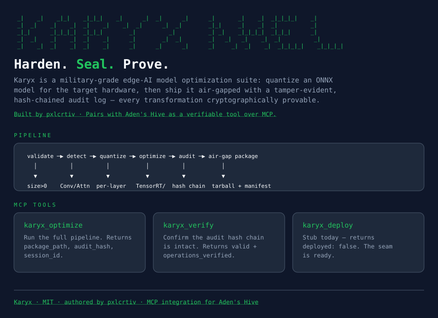

# KARYX



```
 _|    _|    _|_|    _|_|_|    _|      _|  _|      _|      _|       _|    _|  _|_|_|_|    _|
 _|  _|    _|    _|  _|    _|    _|  _|      _|  _|        _|_|     _|    _|  _|          _|
 _|_|      _|_|_|_|  _|_|_|        _|          _|          _| _|    _|_|_|_|  _|_|_|      _|
 _|  _|    _|    _|  _|    _|      _|        _|  _|        _|   _|   _|    _|  _|          _|
 _|    _|  _|    _|  _|    _|      _|      _|      _|      _|     _|  _|    _|  _|_|_|_|    _|_|_|_|
```

**Harden. Seal. Prove.**

Karyx is a military‑grade edge‑AI model optimization suite. It takes a
validated ONNX model, detects its architecture, quantizes it for the target
hardware, and ships it as an **air‑gap package** wrapped in a
**tamper‑evident, hash‑chained audit log** — so every transformation can be
cryptographically proven, not just claimed.

> Built by [`pxlcrtiv`](https://github.com/pxlcrtiv) ·
> Pairs with [Aden's Hive](https://github.com/aden-hive/hive) as a verifiable
> tool over MCP.

---

## Why Karyx exists

Edge deployment is where good models go to die — or to leak. A quantized
model pushed to a thousand devices is only as trustworthy as the pipeline
that produced it. Karyx treats the *artifact* as the unit of accountability:
every step from validation to packaging is recorded in a hash chain that
anyone can verify, even on an isolated machine with no network.

The result isn't just a smaller model. It's a model you can **stand behind**.

---

## What it does

```
 validate ──▶ detect ──▶ quantize ──▶ optimize ──▶ audit ──▶ air-gap package
   │           │           │            │           │            │
   ▼           ▼           ▼            ▼           ▼            ▼
 size>0    Conv/Attn    per-layer   TensorRT/   hash chain   tarball +
 arch fam   walk        precision    Vitis/ONNX  of every IO  manifest +
                                                                    signature
```

| Stage | Module | Responsibility |
|---|---|---|
| **validate** | `karyx.core.validator` | Confirms the model exists, is non‑empty, and has a recognized extension. |
| **detect architecture** | `karyx.core.arch_detector` | Walks the ONNX graph with NetworkX, classifies the model family from Conv / Add / Attention nodes. |
| **adaptive quantize** | `karyx.quantization.adaptive_quant` | Selects a per‑layer precision from the architecture profile. |
| **optimize for hardware** | `karyx.hardware.optimizer_factory` | Dispatches to the correct backend for the target. |
| **audit log** | `karyx.security.audit_logger` | Hash‑chains every input and output into a tamper‑evident journal. |
| **air‑gap package** | `karyx.packaging.air_gap_packager` | Tarballs the model, runtime, manifest, and audit log into one sealed artifact. |

---

## Quickstart

```bash
git clone https://github.com/pxlcrtiv/KARYX.git
cd KARYX
python3 -m venv .venv
source .venv/bin/activate
pip install onnx networkx numpy click PyYAML cryptography pytest

# harden a model for a Generic ARM target at IL5
python -m karyx.cli.main optimize --model model.onnx --target generic-arm --security-level IL5
```

The CLI entry point is `karyx.cli.main:main` (see `pyproject.toml`'s
`[project.scripts]`). It's a small Click group with three subcommands:
`optimize`, `verify`, `deploy`.

---

## Supported targets

| Target | Backend |
|---|---|
| `jetson-nano`, `jetson-xavier`, `jetson-orin` | `TensorRTOptimizer` |
| `xilinx-*` (e.g. `xilinx-zynq`) | `VitisAIOptimizer` |
| `generic-arm` | `ONNXOptimizer` |

Routing is a string‑prefix match in `optimize_for_hardware`. Run
`auto_detect_hardware()` to inspect the host.

## Security levels

Each run carries a classification that the audit logger stamps into the chain.
The packager writes a `manifest.json` holding the classification, and the
air‑gap filename carries the suffix — `.il4.tar.gz`, `.il5.tar.gz`,
`.il6.tar.gz`.

## CLI

```bash
python -m karyx.cli.main optimize --help
python -m karyx.cli.main verify   --help
python -m karyx.cli.main deploy   --help
```

- `optimize` runs the full pipeline and writes a package to disk.
- `verify` reads a package's audit log and confirms its chain integrity.
- `deploy` is a stub today (see `karyx/cli/commands/deploy.py`).

---

## Using Karyx as an MCP server (Hive integration)

Karyx exposes its hardening pipeline as
[Model Context Protocol](https://modelcontextprotocol.io/) tools, so an
autonomous agent — like [Aden's Hive](https://github.com/aden-hive/hive) —
can harden and verify edge‑AI models as a **verifiable, auditable tool**
rather than an opaque shell command. This is the bridge between Hive's
adaptive orchestration and Karyx's trustworthy hands.

### Tools

| Tool | Description |
|---|---|
| `karyx_optimize` | Run the full pipeline and return `{package_path, audit_hash, session_id}`. |
| `karyx_verify` | Extract the audit log from a package and confirm the hash chain is intact. Returns `{valid, operations_verified?, error?}`. |
| `karyx_deploy` | Stub — returns `{deployed: false}`. |

### Setup

```bash
pip install -e ".[mcp]"
```

### Running

```bash
mcp-karyx                 # console script (stdio transport)
python -m mcp_karyx.server  # module invocation
```

### `.mcp.json`

The repo root ships `.mcp.json` for automatic MCP client discovery:

```json
{
  "mcpServers": {
    "karyx": {
      "command": "mcp-karyx",
      "args": [],
      "env": {}
    }
  }
}
```

---

## Development

```bash
pytest                         # full suite (40 tests)
pytest mcp_karyx/tests/ -q    # MCP wrapper tests only
```

Tests cover the audit chain, architecture detection, quantization‑plan
selection, packaging, the CLI smoke path, and the MCP tool layer (with the
pipeline mocked so the harness stays fast and honest).

### Project layout

```
karyx/
├── cli/                 # Click entry points + dashboard
│   ├── main.py
│   ├── dashboard.py
│   └── commands/        # optimize · verify · deploy
├── core/                # validation, arch detection, model loading
├── hardware/            # ABC + factory + three backends
├── quantization/        # adaptive per-layer precision
├── security/            # hash-chained audit logging
├── packaging/           # air-gap tarball + manifest
├── utils/              # cross-cutting helpers
├── workflows/iflow/     # YAML workflow specs
└── tests/               # unit · integration · security
```

## Conventions

- **Vocabulary.** Module, interface, depth, seam, adapter, leverage, locality
  — used consistently across plans and reviews.
- **Deletable tests.** If a test could only pass against itself, the production
  code is rewritten so the test cannot be a no‑op.
- **No secrets in code.** `.env*` is gitignored; signing keys never live in
  the repo.

---

## Acknowledgements

Karyx is authored and maintained by
[**pxlcrtiv**](https://github.com/pxlcrtiv). Its MCP integration is designed
to slot into [Aden's Hive](https://github.com/aden-hive/hive) — the
multi‑agent production harness — turning model hardening into a tool that
autonomous agents can call and verify.

## License

Karyx is **open core** — dual-licensed so the engine stays free while the
military-grade security surface is commercial.

### Open Source (MIT) — free forever
Validated under [LICENSE-MIT](LICENSE-MIT):
- model validation, architecture detection, quantization
- hardware optimization (TensorRT, Vitis, ONNX)
- basic `optimize` / `verify` CLI (IL4)
- the `mcp-karyx` server (Hive integration)
- all tests

**Use it for:** personal projects, research, startups, and commercial products.

### Commercial — required for defense / government / enterprise
Defined in [LICENSE-COMMERCIAL](LICENSE-COMMERCIAL). Covers the hardened
security components:
- IL5 / IL6 cryptographic audit trails (`karyx/security/audit_logger.py`)
- air‑gap deployment packaging (`karyx/packaging/air_gap_packager.py`)
- secure hardware `deploy` (`karyx/cli/commands/deploy.py`)
- monitoring dashboard (`karyx/cli/dashboard.py`)

**No third party may sell or commercially redistribute these components**
without a written license from the copyright holder.

**Use it for:** government, defense, critical infrastructure, enterprise.
Free 30‑day evaluation; then purchase a license (`vdnhhwvzy7@privaterelay.appleid.com`).

Full pricing tiers, feature comparison, and FAQ: **https://pxlcrtiv.github.io/KARYX**

### Quick license check

```bash
python -m karyx.cli.main optimize --model model.onnx --target generic-arm --security-level IL4   # MIT, no key
python -m karyx.cli.main optimize --model model.onnx --target generic-arm --security-level IL5   # eval / commercial
export KARYX_LICENSE_KEY="KARYX-XXXX-XXXX-XXXX-XXXX"   # enable commercial features
```

Programmatic check:

```python
from karyx.licensing import get_license_manager
print(get_license_manager().validate_license())
```

For licensing inquiries: **vdnhhwvzy7@privaterelay.appleid.com**
